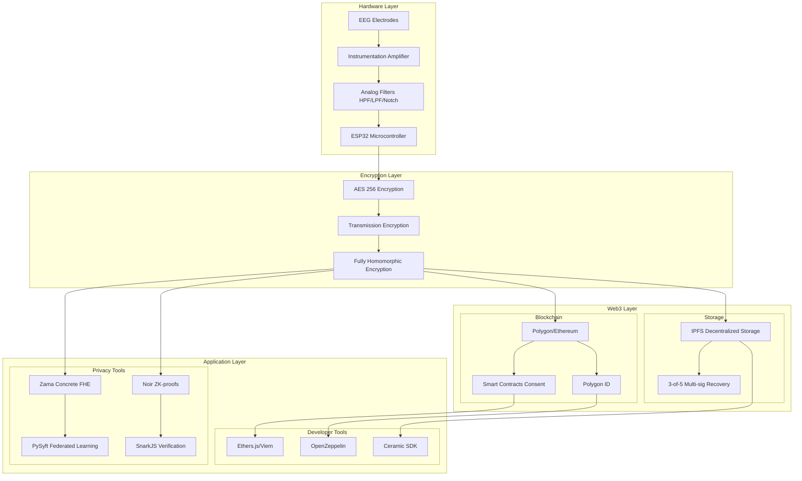
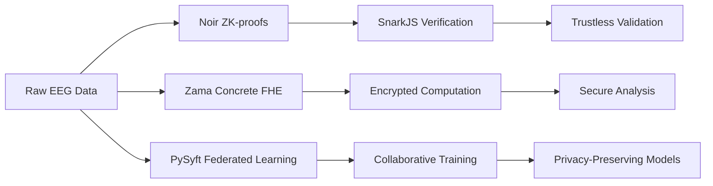
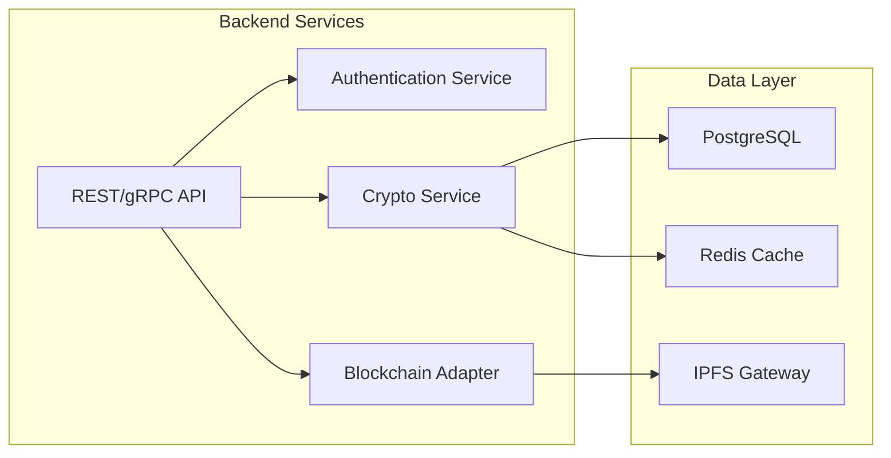
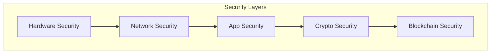

# SAVY - Cognitive & Neural Data Stewardship Architecture

## Project Overview
**Problem Statement:** HBIOT003 - Cognitive & Neural Data Stewardship for Neurotechnologies
**Solution:** Privacy-preserving EEG system with two-layer security (Web3 + Encryption)

---

## System Architecture Diagram



---

## Detailed Architecture Analysis

### 1. Hardware Layer Components

| Component | Purpose | Implementation Notes |
|-----------|---------|---------------------|
| EEG Electrodes | Signal acquisition | Dry electrodes recommended for comfort |
| Instrumentation Amplifier | Signal amplification | Need low-noise design (AD8429 recommended) |
| Analog Filters | Noise reduction | HPF (0.5Hz), LPF (50Hz), Notch (50/60Hz) |
| ESP32 | Data processing | PlatformIO IDE, Bluetooth/WiFi connectivity |

### 2. Security Architecture - Two Layer Approach

#### Layer 1: Web3/Blockchain
- **Blockchain:** Polygon (recommended over Ethereum for lower fees)
- **Smart Contracts:** Consent management using OpenZeppelin standards
- **Identity:** Polygon ID for decentralized identity verification
- **Storage:** IPFS with content addressing for immutable data
- **Key Management:** 3-of-5 multi-signature recovery scheme

#### Layer 2: Encryption
- **AES-256:** At-rest data encryption
- **Transmission Encryption:** TLS-like encryption for data in transit
- **FHE (Fully Homomorphic Encryption):** End-to-end encryption allowing computation on encrypted data

### 3. Privacy-Preserving Technologies



---

## Software Implementation Suggestions

### Phase 1: Core Infrastructure

#### 1.1 Blockchain Integration
```solidity
// Smart Contract Structure
contracts/
├── ConsentManager.sol
├── DataAccessControl.sol
├── NeuroDataRegistry.sol
└── KeyRecovery.sol
```

**Recommendations:**
- Use **Polygon PoS** for faster/cheaper transactions
- Implement **ERC-721** for neurodata NFTs (ownership tracking)
- Use **ERC-1155** for multi-token support (consent tokens)
- Integrate **Gnosis Safe** for multi-signature key recovery

#### 1.2 IPFS Storage Layer
- Use **OrbitDB** or **Ceramic Network** for dynamic data
- Implement **IPFS pinning service** for data persistence
- Add **encrypted chunks** before IPFS upload

### Phase 2: Advanced Cryptography

#### 2.1 FHE Implementation (Zama Concrete)
```python
# FHE Schema Example
from concrete import fhe

@fhe.trace()
def analyze_encrypted_eeg(encrypted_signal):
    # Perform computations on encrypted data
    return processed_signal
```

**Suggestions:**
- Start with **Zama Concrete ML** for ML on encrypted data
- Use **TFHE** library for boolean/integer operations
- Consider **hybrid approach**: FHE for sensitive fields only

#### 2.2 Zero-Knowledge Proofs (Noir + SnarkJS)
```noir
// ZK Proof for consent verification
fn main(data_hash: pub Field, consent_proof: Field) -> bool {
    // Verify consent without revealing data
    assert(data_hash == hash(consent_proof))
}
```

**Use Cases:**
- Prove data ownership without revealing raw data
- Validate model training without exposing training data
- Audit access logs privately

### Phase 3: Application Development

#### 3.1 Backend Architecture


#### 3.2 Technology Stack Recommendations

| Layer | Current | Recommended |
|-------|---------|-------------|
| Blockchain | Ethereum/Polygon | **Polygon PoS** (lower fees) |
| Web3 Library | Ethers.js | **Viem** (newer, faster) |
| Smart Contracts | OpenZeppelin | OpenZeppelin + **Foundry** for testing |
| Identity | Polygon ID | Keep (good choice) |
| Storage | IPFS | **IPFS + Ceramic** for streams |
| FHE | Zama Concrete | Keep (excellent choice) |
| ZK | Noir + SnarkJS | Consider **RISC Zero** for scalability |
| Backend | - | **Node.js/TypeScript** or **Rust** |
| Database | - | **PostgreSQL** + **Redis** |

---

## Critical Implementation Considerations

### 1. Performance Optimization
- FHE is computationally expensive → use **hybrid encryption** (FHE only for sensitive operations)
- IPFS latency → implement **edge caching** with Redis
- Blockchain gas costs → batch transactions, use **meta-transactions**

### 2. Security Hardening


- Add **hardware security module (HSM)** for key storage
- Implement **rate limiting** and **DDoS protection**
- Regular **security audits** for smart contracts
- **Key rotation** schedule for encryption keys

### 3. Scalability
- Use **Layer 2 solutions** for off-chain computation
- Implement **data sharding** for IPFS
- Consider **Streamr** or **Substrate** for real-time data streams

---

## Implementation Roadmap

### Sprint 1-2: Foundation
- [ ] Set up Polygon testnet environment
- [ ] Deploy basic consent smart contracts
- [ ] Implement IPFS storage layer
- [ ] Create ESP32 firmware for EEG acquisition

### Sprint 3-4: Core Privacy Features
- [ ] Integrate AES-256 encryption
- [ ] Implement FHE for sensitive data
- [ ] Add ZK-proof verification
- [ ] Build key recovery system (3-of-5)

### Sprint 5-6: Application Layer
- [ ] Develop REST API
- [ ] Create dashboard for researchers
- [ ] Implement access control system
- [ ] Add audit logging

### Sprint 7-8: Testing & Deployment
- [ ] Smart contract security audit
- [ ] Penetration testing
- [ ] Performance optimization
- [ ] Mainnet deployment

---

## Recommendations Summary

### ✅ Strengths
1. **Strong security model** with dual-layer protection
2. **Appropriate tech stack** (Polygon, Zama, Noir are good choices)
3. **Novel approach** combining hardware + blockchain privacy
4. **Clear business model** targeting privacy-conscious users

### ⚠️ Areas for Improvement
1. **Consider simplifying** - full FHE + ZK + blockchain may be overkill
2. **Start with Polygon** (not Ethereum) for cost reasons
3. **Add hardware security** (secure element for key storage)
4. **Consider user experience** - current stack is very technical
5. **Add data standardization** - BIDS format for neurodata

### 🚀 Enhancement Suggestions
1. Add **AI/ML pipeline** for encrypted EEG analysis
2. Implement **user-friendly wallet** for consent management
3. Add **real-time streaming** using WebRTC + encrypted channels
4. Consider **mobile app** for EEG data collection
5. Add **compliance framework** (GDPR, HIPAA considerations)

---

## Conclusion

SAVY presents a **comprehensive privacy solution** for neurotechnology data stewardship. The architecture is well-thought-out with appropriate technology choices. Key focus areas for successful implementation:

1. **Start with MVP** - implement core consent + storage first
2. **Optimize for performance** - FHE is expensive, use strategically
3. **Focus on UX** - abstract complexity for end users
4. **Security first** - audit smart contracts before mainnet
5. **Scalability planning** - design for growth from day one

The combination of hardware signal conditioning, multi-layer encryption, and blockchain governance creates a **defense-in-depth approach** that addresses the critical privacy concerns in neurotechnology.
