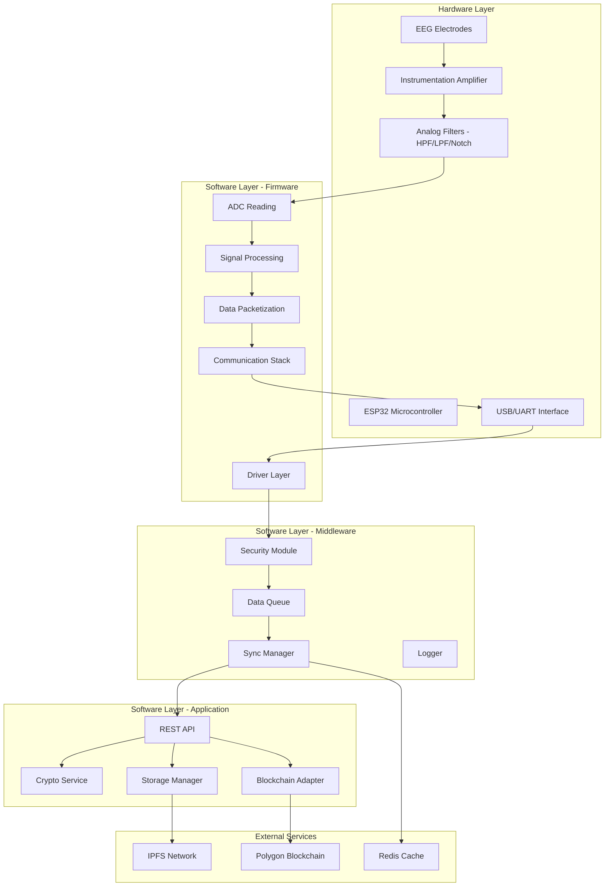
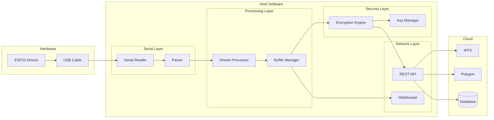
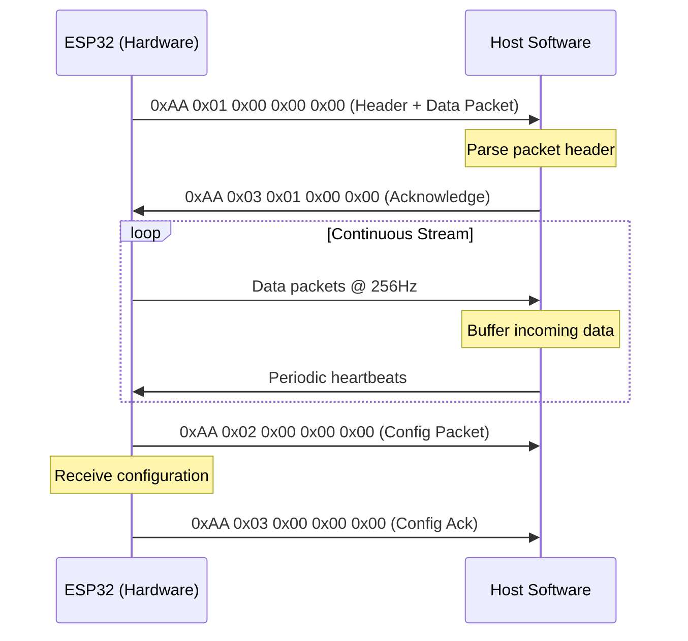

# SAVY - Software Architecture with Hardware Integration

## Hardware-Software Integration Architecture



---

## Firmware Architecture (ESP32)

### Directory Structure
```
firmware/
├── src/
│   ├── main.cpp
│   ├── drivers/
│   │   ├── adc_driver.h/cpp
│   │   ├── filter_driver.h/cpp
│   │   └── communication_driver.h/cpp
│   ├── processing/
│   │   ├── signal_processor.h/cpp
│   │   ├── noise_reduction.h/cpp
│   │   └── data_formatter.h/cpp
│   ├── security/
│   │   ├── encryption.h/cpp
│   │   └── key_management.h/cpp
│   └── communication/
│       ├── ble_handler.h/cpp
│       ├── wifi_handler.h/cpp
│       └── protocol.h/cpp
├── include/
├── lib/
├── platformio.ini
└── test/
```

### Core Firmware Implementation

```cpp
// src/main.cpp
#include "adc_driver.h"
#include "signal_processor.h"
#include "encryption.h"
#include "communication.h"

#define SAMPLE_RATE 256  // Hz
#define BUFFER_SIZE 512

class EEGSystem {
private:
    ADCDriver adc;
    SignalProcessor processor;
    EncryptionModule encryption;
    CommunicationModule comm;
    DataBuffer buffer;
    
public:
    void begin() {
        adc.initialize();
        processor.initialize();
        encryption.initialize();
        comm.begin();
    }
    
    void run() {
        while (true) {
            // Read raw EEG data
            float* rawSamples = adc.readBatch(BUFFER_SIZE);
            
            // Apply filters
            float* filteredSamples = processor.applyFilters(rawSamples, BUFFER_SIZE);
            
            // Encrypt data
            EncryptedPacket packet = encryption.encrypt(filteredSamples, BUFFER_SIZE);
            
            // Send to host
            comm.sendPacket(packet);
            
            // Free memory
            free(rawSamples);
            free(filteredSamples);
        }
    }
};
```

### ADC Driver Implementation
```cpp
// src/drivers/adc_driver.h
#ifndef ADC_DRIVER_H
#define ADC_DRIVER_H

#include <Arduino.h>

class ADCDriver {
private:
    static const int NUM_CHANNELS = 4;
    static const int ADC_RESOLUTION = 12;
    static const float REFERENCE_VOLTAGE = 3.3;
    
    int channelPins[NUM_CHANNELS];
    float calibrationOffsets[NUM_CHANNELS];
    
public:
    void initialize();
    float readSingleChannel(int channel);
    float* readBatch(int numSamples);
    void calibrate();
    float getSampleRate();
};

#endif
```

### Signal Processing Module
```cpp
// src/processing/signal_processor.h
#ifndef SIGNAL_PROCESSOR_H
#define SIGNAL_PROCESSOR_H

#include <Arduino.h>

struct EEGSample {
    float channel[4];
    uint32_t timestamp;
    uint16_t sequence;
};

class SignalProcessor {
private:
    // Filter coefficients
    float hpFilterCoefs[6];   // High-pass (0.5Hz)
    float lpFilterCoefs[6];   // Low-pass (50Hz)
    float notchFilterCoefs[6]; // Notch (50Hz)
    
    // State variables
    float hpState[4][3];
    float lpState[4][3];
    float notchState[4][3];
    
public:
    struct ProcessingConfig {
        float highPassCutoff = 0.5f;
        float lowPassCutoff = 50.0f;
        float notchFrequency = 50.0f;
        float sampleRate = 256.0f;
        bool enableNotch = true;
        bool enableHPF = true;
        bool enableLPF = true;
    };
    
    void initialize();
    void applyFilters(float* samples, int numSamples, int numChannels);
    float* applyFilters(float* samples, int numSamples);
    EEGSample processSample(float* rawChannels);
    void setConfig(ProcessingConfig config);
};

#endif
```

### Communication Protocol
```cpp
// src/communication/protocol.h
#ifndef PROTOCOL_H
#define PROTOCOL_H

#include <Arduino.h>

#define PACKET_HEADER 0xAA
#define PACKET_footer 0x55
#define MAX_PAYLOAD_SIZE 240

enum PacketType {
    DATA_PACKET = 0x01,
    CONFIG_PACKET = 0x02,
    STATUS_PACKET = 0x03,
    COMMAND_PACKET = 0x04,
    ENCRYPTED_PACKET = 0x05
};

struct __attribute__((packed)) EEGPacket {
    uint8_t header;
    uint8_t type;
    uint16_t sequence;
    uint32_t timestamp;
    uint8_t payload[MAX_PAYLOAD_SIZE];
    uint16_t crc;
    uint8_t footer;
};

class Protocol {
private:
    uint16_t sequenceCounter;
    
public:
    EEGPacket createDataPacket(float* channels, uint8_t numChannels);
    EEGPacket createEncryptedPacket(uint8_t* encryptedData, uint16_t dataLen);
    bool validatePacket(EEGPacket& packet);
    PacketType getPacketType(EEGPacket& packet);
};

#endif
```

---

## Host Software Architecture

### System Architecture


### Core Software Components

#### 1. Data Acquisition Service
```python
# services/data_acquisition.py
import serial
import asyncio
from typing import Optional
from dataclasses import dataclass
from cryptography.hazmat.primitives.ciphers import Cipher, algorithms, modes
from cryptography.hazmat.backends import default_backend

@dataclass
class EEGDataPoint:
    timestamp: float
    channel_1: float
    channel_2: float
    channel_3: float
    channel_4: float
    sequence: int

class DataAcquisitionService:
    def __init__(self, port: str, baudrate: int = 115200):
        self.port = port
        self.baudrate = baudrate
        self.serial_connection: Optional[serial.Serial] = None
        self.buffer = bytearray()
        self.running = False
        
    async def start(self):
        """Start data acquisition from ESP32"""
        self.serial_connection = serial.Serial(
            port=self.port,
            baudrate=self.baudrate,
            bytesize=serial.EIGHTBITS,
            parity=serial.PARITY_NONE,
            stopbits=serial.STOPBITS_ONE
        )
        self.running = True
        await self._read_stream()
    
    async def _read_stream(self):
        """Continuous stream reading"""
        while self.running:
            if self.serial_connection.in_waiting:
                data = self.serial_connection.read(
                    self.serial_connection.in_waiting
                )
                self.buffer.extend(data)
                await self._process_buffer()
    
    async def _process_buffer(self):
        """Parse complete packets from buffer"""
        while len(self.buffer) >= 16:  # Minimum packet size
            if self.buffer[0] != 0xAA:  # Header
                self.buffer.pop(0)
                continue
            
            packet_type = self.buffer[1]
            payload_length = self.buffer[2]
            
            if len(self.buffer) < 5 + payload_length + 2:
                break  # Incomplete packet
            
            # Extract packet
            packet = self.buffer[:5 + payload_length + 2]
            self.buffer = self.buffer[5 + payload_length + 2:]
            
            # Parse and yield data point
            data_point = self._parse_packet(packet)
            if data_point:
                await self._dispatch(data_point)
    
    def _parse_packet(self, packet: bytearray) -> Optional[EEGPacket]:
        """Parse raw packet into EEGDataPoint"""
        # Implementation for parsing binary protocol
        pass
```

#### 2. Encryption Service
```python
# services/encryption.py
from cryptography.hazmat.primitives import hashes, serialization
from cryptography.hazmat.primitives.asymmetric import rsa, padding
from cryptography.hazmat.primitives.ciphers.aead import AESGCM
import hashlib
import secrets

class EncryptionService:
    def __init__(self):
        self.aes_key: bytes = None
        self.rsa_private_key = None
        self.rsa_public_key = None
        self.nonce_counter = 0
    
    def initialize(self):
        """Initialize encryption keys"""
        # Generate AES-256 key for symmetric encryption
        self.aes_key = secrets.token_bytes(32)
        
        # Generate RSA key pair for key exchange
        self.rsa_private_key = rsa.generate_private_key(
            public_exponent=65537,
            key_size=2048,
            backend=default_backend()
        )
        self.rsa_public_key = self.rsa_private_key.public_key()
    
    def encrypt_data(self, data: bytes) -> dict:
        """Encrypt EEG data using AES-256-GCM"""
        aesgcm = AESGCM(self.aes_key)
        nonce = secrets.token_bytes(12)
        
        # Add metadata
        metadata = {
            "timestamp": self._get_timestamp(),
            "sequence": self.nonce_counter,
            "version": "1.0"
        }
        
        combined_data = self._pack_data(data, metadata)
        ciphertext = aesgcm.encrypt(nonce, combined_data, None)
        
        self.nonce_counter += 1
        
        return {
            "ciphertext": ciphertext,
            "nonce": nonce.hex(),
            "metadata": metadata
        }
    
    def encrypt_for_transmission(self, encrypted_data: dict) -> dict:
        """Encrypt the AES key using RSA for transmission"""
        # Encrypt AES key with RSA
        encrypted_key = self.rsa_public_key.encrypt(
            self.aes_key,
            padding.OAEP(
                mgf=padding.MGF1(algorithm=hashes.SHA256()),
                algorithm=hashes.SHA256(),
                label=None
            )
        )
        
        return {
            "encrypted_key": encrypted_key.hex(),
            "encrypted_data": encrypted_data
        }
    
    def decrypt_data(self, ciphertext: bytes, nonce: bytes) -> bytes:
        """Decrypt received data"""
        aesgcm = AESGCM(self.aes_key)
        return aesgcm.decrypt(nonce, ciphertext, None)
```

#### 3. Blockchain Integration Service
```python
# services/blockchain.py
from web3 import Web3
from eth_account import Account
from dataclasses import dataclass
from typing import List, Optional
import json

@dataclass
class ConsentRecord:
    user_id: str
    researcher_id: str
    data_hash: str
    timestamp: int
    expires_at: int
    permissions: List[str]
    signature: str

class BlockchainService:
    def __init__(self, provider_url: str, private_key: str):
        self.w3 = Web3(Web3.HTTPProvider(provider_url))
        self.account = Account.from_key(private_key)
        self.contract = None
        self.contract_address = None
    
    def load_contract(self, contract_abi: str, address: str):
        """Load smart contract"""
        self.contract_address = Web3.to_checksum_address(address)
        self.contract = self.w3.eth.contract(
            address=self.contract_address,
            abi=json.loads(contract_abi)
        )
    
    async def register_data(self, data_hash: str, metadata: dict) -> str:
        """Register EEG data hash on blockchain"""
        nonce = self.w3.eth.get_transaction_count(
            self.account.address
        )
        
        tx = self.contract.functions.registerData(
            data_hash,
            metadata
        ).build_transaction({
            'chainId': 137,  # Polygon
            'gas': 300000,
            'gasPrice': self.w3.to_wei('30', 'gwei'),
            'nonce': nonce
        })
        
        signed_tx = self.account.sign_transaction(tx)
        tx_hash = self.w3.eth.send_raw_transaction(
            signed_tx.rawTransaction
        )
        
        return tx_hash.hex()
    
    async def grant_consent(
        self, 
        user_id: str, 
        researcher_id: str, 
        data_hash: str,
        permissions: List[str],
        duration_days: int
    ) -> ConsentRecord:
        """Grant consent for data access"""
        # Create consent record
        consent = ConsentRecord(
            user_id=user_id,
            researcher_id=researcher_id,
            data_hash=data_hash,
            timestamp=int(time.time()),
            expires_at=int(time.time()) + duration_days * 86400,
            permissions=permissions,
            signature=""
        )
        
        # Sign consent
        message = self._create_consent_message(consent)
        consent.signature = self.account.sign_message(message).signature.hex()
        
        # Store on blockchain
        tx = self.contract.functions.grantConsent(
            consent.user_id,
            consent.researcher_id,
            consent.data_hash,
            consent.permissions,
            consent.expires_at,
            consent.signature
        ).build_transaction({
            'chainId': 137,
            'gas': 300000,
            'gasPrice': self.w3.to_wei('30', 'gwei'),
            'nonce': await self._get_nonce()
        })
        
        signed_tx = self.account.sign_transaction(tx)
        tx_hash = self.w3.eth.send_raw_transaction(signed_tx.rawTransaction)
        
        return consent
    
    async def verify_consent(self, consent: ConsentRecord) -> bool:
        """Verify consent is valid and not revoked"""
        return self.contract.functions.verifyConsent(
            consent.user_id,
            consent.researcher_id,
            consent.data_hash
        ).call()
```

#### 4. IPFS Storage Service
```python
# services/ipfs_storage.py
import ipfshttpclient
from cryptography.fernet import Fernet
from dataclasses import dataclass
from typing import Optional
import json
import time

@dataclass
class StoredData:
    cid: str
    encryption_key: str
    timestamp: int
    metadata: dict

class IPFSStorageService:
    def __init__(self, ipfs_host: str = "/ip4/127.0.0.1/tcp/5001"):
        self.client = ipfshttpclient.connect(ipfs_host)
        self.fernet_key = Fernet.generate_key()
        self.cipher = Fernet(self.fernet_key)
    
    async def upload_eeg_data(
        self, 
        data: bytes, 
        metadata: dict
    ) -> StoredData:
        """Upload encrypted EEG data to IPFS"""
        # Add metadata
        metadata["upload_timestamp"] = int(time.time())
        metadata["size"] = len(data)
        
        # Encrypt data
        encrypted_data = self.cipher.encrypt(data)
        
        # Add to IPFS
        result = self.client.add_bytes(encrypted_data)
        cid = result['Hash']
        
        # Pin the data
        self.client.pin.add(cid)
        
        return StoredData(
            cid=cid,
            encryption_key=self.fernet_key.decode(),
            timestamp=int(time.time()),
            metadata=metadata
        )
    
    async def retrieve_eeg_data(self, cid: str) -> bytes:
        """Retrieve and decrypt EEG data from IPFS"""
        # Get from IPFS
        encrypted_data = self.client.cat(cid)
        
        # Decrypt
        return self.cipher.decrypt(encrypted_data)
    
    async def get_data_info(self, cid: str) -> dict:
        """Get IPFS data information"""
        stats = self.client.files.stat(cid)
        return {
            "cid": cid,
            "size": stats['Size'],
            "cumulative_size": stats['CumulativeSize'],
            "blocks": stats['Blocks'],
            "type": stats['Type']
        }
```

---

## Hardware-Software Interface Specification

### Serial Communication Protocol


### Data Packet Format
| Offset | Size | Field | Description |
|--------|------|-------|-------------|
| 0 | 1 | Header | 0xAA |
| 1 | 1 | Type | 0x01 = Data |
| 2 | 2 | Length | Payload length |
| 4 | 4 | Timestamp | Unix timestamp (ms) |
| 8 | 2 | Sequence | Packet sequence number |
| 10 | N | Payload | EEG data (float32 per channel) |
| 10+N | 2 | CRC16 | Error detection |
| 12+N | 1 | Footer | 0x55 |

### Configuration Commands
| Command | Value | Description |
|---------|-------|-------------|
| SET_SAMPLE_RATE | 0x01 | Set sampling rate (Hz) |
| SET_CHANNELS | 0x02 | Enable/disable channels |
| SET_GAIN | 0x03 | Set amplifier gain |
| GET_STATUS | 0x04 | Request device status |
| CALIBRATE | 0x05 | Start calibration |
| RESET | 0x06 | Reset device |

---

## Integration Points

### 1. ESP32 to Host Communication
```cpp
// Firmware - sending data
void sendDataPacket(float* channels, int numChannels) {
    EEGPacket packet;
    packet.header = 0xAA;
    packet.type = DATA_PACKET;
    packet.sequence = sequenceCounter++;
    packet.timestamp = millis();
    
    // Pack channel data
    uint8_t* payloadPtr = packet.payload;
    for (int i = 0; i < numChannels; i++) {
        uint32_t encoded = floatToFixed(channels[i], 20);  // 20-bit fixed point
        memcpy(payloadPtr, &encoded, 3);
        payloadPtr += 3;
    }
    
    // Calculate CRC
    packet.crc = calculateCRC(packet.payload, payloadPtr - packet.payload);
    packet.footer = 0x55;
    
    // Send via Serial
    Serial.write((uint8_t*)&packet, sizeof(packet));
}
```

### 2. Host Processing Pipeline
```python
# Main processing pipeline
class ProcessingPipeline:
    def __init__(self):
        self.acquisition = DataAcquisitionService()
        self.encryption = EncryptionService()
        self.blockchain = BlockchainService()
        self.ipfs = IPFSStorageService()
        self.buffer = RingBuffer(max_size=1000)
    
    async def start(self):
        """Start the complete pipeline"""
        # Initialize all services
        await self.encryption.initialize()
        await self.blockchain.load_contract()
        
        # Start acquisition
        await self.acquisition.start()
        
        # Process incoming data
        async for data_point in self.acquisition.stream():
            # Buffer the data
            self.buffer.push(data_point)
            
            # Batch process for blockchain storage
            if self.buffer.is_full():
                batch = self.buffer.get_batch()
                await self._process_batch(batch)
    
    async def _process_batch(self, batch: List[EEGPacket]):
        """Process a batch of EEG data"""
        # Convert to binary format
        binary_data = self._serialize_batch(batch)
        
        # Encrypt
        encrypted = self.encryption.encrypt_data(binary_data)
        
        # Store to IPFS
        ipfs_result = await self.ipfs.upload_eeg_data(
            encrypted["ciphertext"],
            {"sample_count": len(batch), "channels": 4}
        )
        
        # Register hash on blockchain
        data_hash = self._calculate_hash(binary_data)
        await self.blockchain.register_data(
            data_hash,
            {"ipfs_cid": ipfs_result.cid, "timestamp": int(time.time())}
        )
```

---

## Recommended Software Stack

| Layer | Technology | Purpose |
|-------|------------|---------|
| Firmware | PlatformIO + ESP-IDF | ESP32 development |
| Firmware Lang | C++ | Real-time processing |
| Host Runtime | Python 3.10+ | Data processing |
| Serial Comm | PySerial + asyncio | Hardware interface |
| Encryption | Cryptography + AESGCM | Data encryption |
| Blockchain | Web3.py + Polygon | Smart contracts |
| IPFS | ipfshttpclient | Decentralized storage |
| API | FastAPI + uvicorn | REST endpoints |
| WebSocket | websockets | Real-time streaming |
| Database | PostgreSQL + Redis | Metadata & caching |
